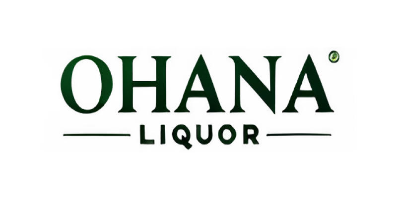

# Ohana-Liquor

  

 

## 개요

프로젝트명: Ohana Liquor

프로젝트 기간(7주): 2024.09.05 ~ 2024.10.21

팀원(4명) 
천송희(PM, Admin) 
**엄세현**(PL, Admin, Developer) 
박정한(Admin, Developer) 
장윤지(Admin, Developer) 

## 소개

오하나 주류(Ohana-Liquor)는 전반적인 고객사의 영업 성과를 향상하는 데 도움을 주는 세일즈포스 플랫폼입니다. 사용자는 표준화된 프로세스로 평균적인 성과 상승 및 편차를 극복하고, 자동화를 통한 실수 방지, 웹 페이지를 통한 신규 고객 유입 및 다양한 대시보드 및 차트를 통한 핵심 지표 시각화를 통해 인사이트 도출이 가능합니다. 이를 통해 고객 관리부터 성과 관리까지 한 번에 해결하는 통합된 데이터 환경을 구축하였습니다.

각 임원진, 본부장, 영업사원은 자신의 홈페이지를 확인하여 오늘의 해야 하는 일 및 현재 지표, 그리고 추가 공지 사항 등을 확인할 수 있습니다. 그뿐만 아니라, 영업 사원이 신규 리드를 기회로 전환하여 이를 성공시키기까지의 성공 지표 및 프로세스 자동 업데이트로 실수를 줄이고 다음 목표를 제시합니다. 이와 같은 표준화 및 자동화 프로세스를 통해 영업 사원 간의 성과 편차 및 실수를 극복하고 전반적인 성과 상승을 이룰 수 있도록 도와줍니다.
본부장과 임원진은 각 영업 사원의 관리 및 트래킹이 용이하도록 다양한 대시보드와 전체 회사 상황 및 고객사별 관리 현황을 확인할 수 있는 대시보드와 더불어 모든 정보의 실시간 업데이트를 통한 효율적인 업무 관리 및 인사이트 도출이 가능해집니다.

## 배경

- 분산된 고객 데이터 및 이로 인한 데이터 정합성에 대한 불신
- 소통 지연으로 인한 정보 업데이트 지연 및 성과 추적 어려움
- 보고서 작성, 소통 지연, 데이터 재검색 등으로 인한 시간 낭비
- 영업 사원간의 성과 편차 발생
  

## 목표

- 다양한 대시보드를 통한 핵심 지표 시각화
- Chatter 및 실시간 정보 업데이트
- 보고서 자동 작성, 데이터 정형화
- 영업 사원의 프로세스 표준화 및 자동화
  

## 주요 기능

- **Web-To-Lead**: 신규 고객 유입 경로 제공
- **Opportunity Path**: 영업 사원에게 표준화된 영업 프로세스 제공
- **Stage Flow & Validation**: 영업 프로세스 자동 업데이트를 통한 실수 방지
- **Quote Comparison**: 견적 비교를 통한 고객 편의성 및 선택지 제공
- **Current KIP Chart**: 현재 매출 현황표를 통한 고객 관리성 향상
- **Quick Campaign Add**: 현황표 확인 후 즉시 캠페인 추가로 고객 관리성 향상
- **Quick New Order Creation**: 현황표 확인 후 즉시 주문 추가로 고객 관리성 향상
- **Various Dashboards & Home layout**: 다양한 대시보드 및 홈 레이아웃을 통해 하루 일정 확인 및 새로운 인사이트 도출 장려

## 기대 효과

- 업무 프로세스 표준화를 통한 전체적인 업무 성과 편차 해소
- 통합된 데이터 환경으로 인한 시간 낭비 해소
- 다양한 대시보드를 이용한 인사이트 도출

## 환경 상세

### IDE

- Visual Studio Code

### Edition

- Salesforce Developer Edition

### License

- Sales Cloud
- Experience Cloud

### Tools

- Jira
- Notion
- Slack
- Excalidraw
- ERD Cloud

## 데이터베이스 ERD

  

 

## 🙋‍♂️ Distributed Roles

#### 천송희

- 프로젝트 매니저 (PM)
- Salesforce Admin

#### 엄세현

- 프로그래밍 리더(PL; Salesforce Developer)
- 웹 페이지 디자인 및 개발 (Web-To-Lead; Experience Cloud)
  - 이미지 리소스 생성 및 업로드 (Static Resources)
  - Carousel 슬라이드 컴포넌트 (LWC)
  - Lead Form 컴포넌트 (LWC)
- Opportunity 페이지 레이아웃 및 개발
  - Path 설정 및 지표 작성
  - Field 배치 및 추가
  - 자동 Stage 업데이트 Flow 작성
  - Opportunity Validation Rule 추가
  - Quick Order 컴포넌트 개발 (LWC)
  - Quick Campaign Add 컴포넌트 개발 (Screen Flow)
- 고객 페이지 지도 컴포넌트 개발 (LWC; Standard map)

#### 박정한

- Salesforce Developer

#### 장윤지

- Salesforce Developer

 

 

## 최종 결과 영상

